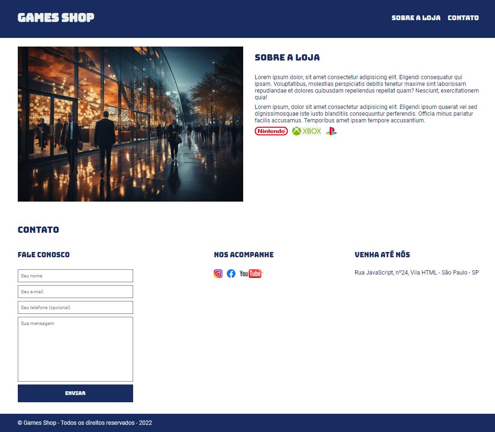

<h1 align="center">🎮 Games Shop Project 🎮</h1>

    
  

## Descrição do Projeto

O projeto "Games Shop" foi proposto pela EBAC. É uma loja de jogos online fictícia que oferece uma experiência visual de qualidade ao leitor.

### [Visite o projeto](https://gamesshop-chi.vercel.app/)

 

## Tópicos do Projeto

- Sobre a Loja: Informações fictícias sobre a loja Games Shope.
- Contato: Local para se fazer contato com a loja atraves de mensagem.
- Nos acompanhe: Redes sociais da loja.
- Venha até nós: Contém o endereço fictício.

 
<h2 align="center"> Desenvolvido por:
</h2>

<h3 align="center"> Renata Ribeiro 

</h3>
  
